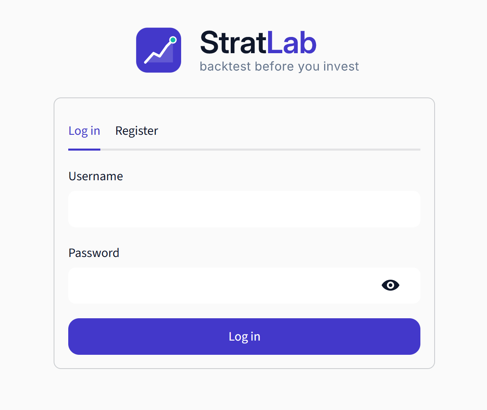
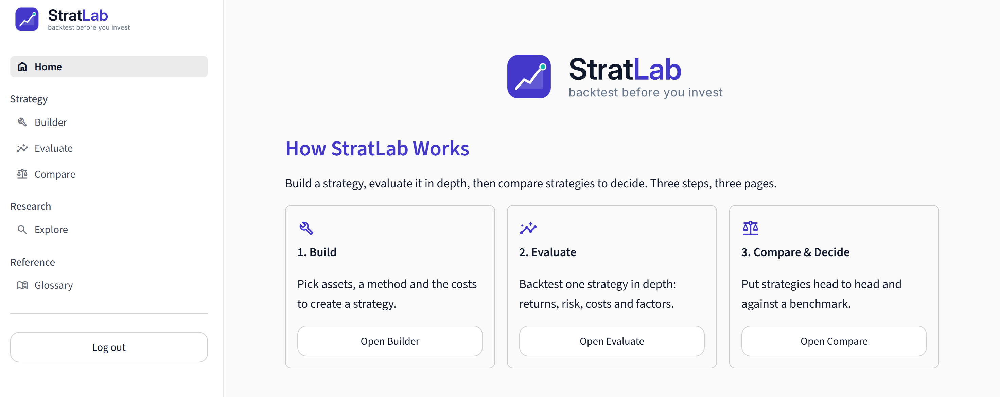
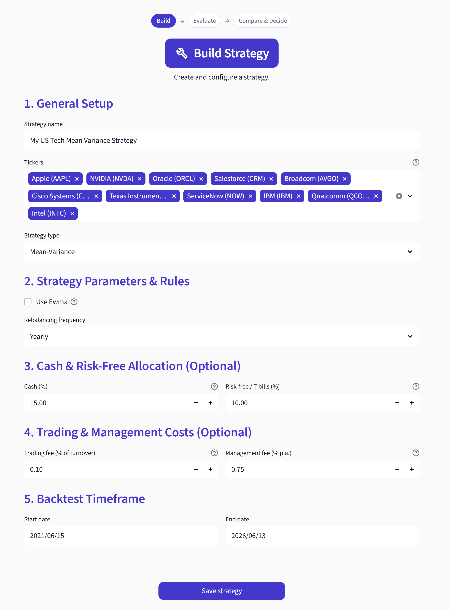
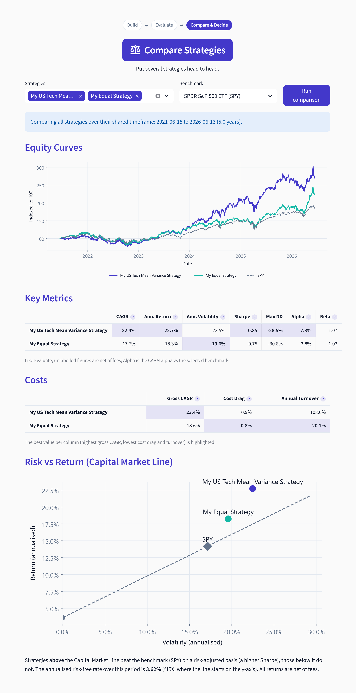
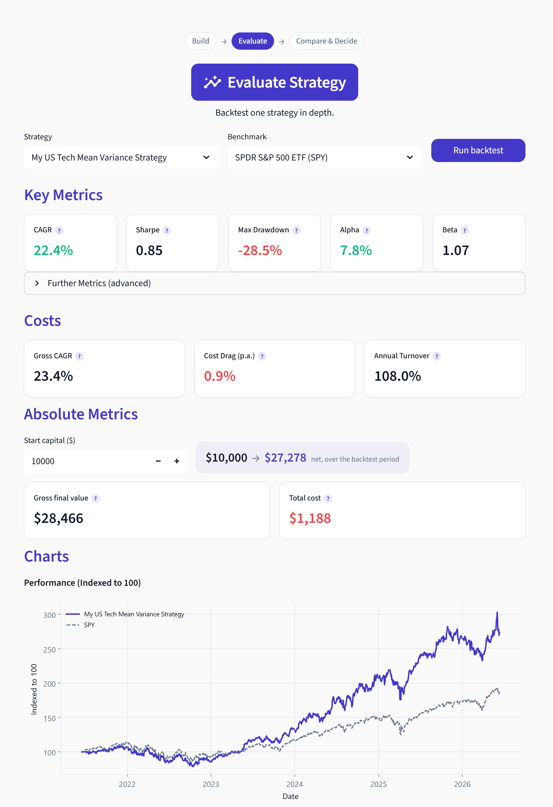
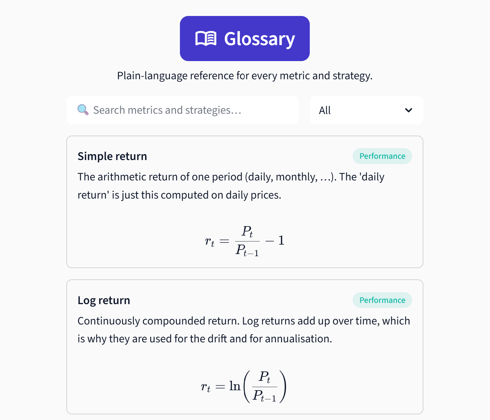

# StratLab User Guide

This guide walks through StratLab the way you would actually use it, from logging in
to comparing finished strategies. You do not need to know any finance jargon to
follow along; every term also has its own entry in the in-app Glossary.

The whole app follows one simple idea: **Build a strategy, Evaluate it in depth,
then Compare and Decide.**

## 1. Getting in

When you open StratLab you land on a welcome screen.

- If no database is connected, you simply click **"Enter StratLab (guest)"** and you
  are in right away. In guest mode your saved strategies live only for the current
  session, which is perfect for trying things out.
- If a database is connected, you can **register** a username and password, or **log
  in** with an existing account. Your strategies are then saved permanently and are
  waiting for you the next time you log in.

A sidebar on the left lets you move between the pages at any time, and there is a
**Log out** button at the bottom of it.

## 2. The Home page

Home is your starting point. It has four parts:

- **How StratLab Works**: the three-step flow (Build, Evaluate, Compare and Decide),
  each with a button that takes you straight to that page.
- **Your Strategies**: a card for every strategy you have saved, showing how your
  capital is split (a small donut chart of the strategy, risk-free and cash sleeves),
  the strategy type and tickers, and its last net CAGR and Sharpe ratio. Each card
  has an **Update** button (re-runs the backtest with fresh data up to yesterday)
  and a **Delete** button. You can also sort your cards by Sharpe, CAGR or smallest
  drawdown.
- **Research The Universe** and **The Theory**: shortcuts to the Explore and Glossary
  pages.
- **About Us**: who we are and why we built the app.

If you have not built anything yet, Home points you to the Builder to create your
first strategy.

## 3. Build a strategy (Builder)

The Builder is where you set up a strategy. It is laid out as a simple form in five
steps.

**1. General Setup.** Give the strategy a name (for example "My 60/40"), search and
select your tickers (you can search by company name, such as "Microsoft (MSFT)", or
type a symbol directly), and pick a strategy type.

The five strategy types, in plain language:

- **Equal Weight**: split your money evenly across all tickers (the "1/N" rule). It
  is a surprisingly hard benchmark to beat.
- **Fixed Weight**: you choose the weights yourself, for example 60% stocks and 40%
  bonds.
- **Momentum**: rank the assets by their recent return and invest in the top
  performers, with the option to also short the worst ones.
- **Inverse Volatility**: give calmer assets a bigger weight and more volatile assets
  a smaller weight.
- **Mean-Variance**: the classic Markowitz portfolio that looks for the best return
  per unit of risk.

**2. Strategy Parameters & Rules.** Depending on the type you picked, the form shows
the relevant settings (for example the lookback window and how many top performers
for Momentum, or one weight per ticker for Fixed Weight, with a live check that they
sum to 100%). You also choose the **rebalancing frequency** (monthly, quarterly,
yearly or a custom number of trading days), which is how often the portfolio is
re-balanced back to its target weights.

**3. Cash & Risk-Free Allocation (optional).** You can hold part of the portfolio in
cash (earns nothing) or in a risk-free asset like T-bills (earns the risk-free rate).

**4. Trading & Management Costs (optional).** Add a trading fee charged on the amount
traded at each rebalance, and an annual management fee deducted daily. This turns the
"gross" result into a realistic "net" one.

**5. Backtest Timeframe.** Pick the start and end dates for the simulation (the end
date has to be yesterday or earlier, since today's prices are not settled yet).

When you click **Save strategy**, StratLab checks everything first. It tells you if a
name is missing, if a ticker has no price data (a typo or a delisted symbol), if the
dates are wrong, or if the weights do not add up, and only saves once the setup is
valid. Note that saving stores the configuration, not a backtest result; the actual
backtest runs on the Evaluate page.

## 4. Evaluate one strategy (Evaluate)

This is where a strategy comes to life. You select one of your saved strategies and a
benchmark to compare it against, and StratLab runs the full backtest. You then get:

- **Key metrics** such as CAGR, Sharpe and Sortino ratios, maximum drawdown, alpha
  and beta, plus the start-to-final value of one unit of capital.
- A **cost analysis** showing how much the trading and management fees ate into the
  result.
- **Charts**: the equity curve (your portfolio versus the benchmark), the drawdown
  over time, how the allocation shifted at each rebalance, and a monthly returns
  heatmap.
- **Factor models** (CAPM and the Fama-French 3 and 5 factor regressions) that break
  the return down into market and style exposures.
- The **Capital Market Line**, a risk and return scatter that shows where your
  strategy sits relative to the benchmark.
- A **next-day direction forecast**, a small machine-learning add-on that estimates
  the probability that the portfolio rises tomorrow. This is clearly labelled as for
  educational purposes only.

## 5. Compare strategies (Compare)

Once you have a few strategies, Compare puts them head to head. You select two or
more saved strategies, and StratLab evaluates them over the period they all share
(from the latest common start date to the earliest common end date), so the
comparison is fair. You get:

- A **Key Metrics** table ranking the strategies.
- A **Costs** table.
- A combined **Capital Market Line** chart with every strategy and the benchmark on
  the same risk and return picture.

This is the "Decide" part of the flow: a clean, side-by-side view to pick a winner.

## 6. Research tickers (Explore)

Explore is for getting to know the assets before you build anything. For any set of
tickers and date range, it shows the price history, return and volatility statistics,
company fundamentals, and a correlation heatmap between the tickers.

 Each selected
ticker also gets its own next-day direction forecast. If a ticker comes back with no
data, Explore warns you and names it instead of quietly dropping it.

## 7. Look things up (Glossary)

The Glossary is a searchable, colour-coded reference that explains every metric and
strategy used in the app, grouped from the basics to the advanced, each with its
formula and an academic citation where relevant.

 If you ever wonder what a Sharpe
ratio or the Capital Market Line is, this is the place.

## A typical journey

1. Start in **Explore** to look at a few tickers and their correlations.
2. Go to the **Builder** and save one or two strategies (say an Equal Weight and a
   Momentum on the same tickers).
3. Open **Evaluate** to study each one in depth against a benchmark.
4. Finish in **Compare** to see them side by side and decide which you prefer.

That is the full loop, from a hunch to an evidence-based decision, in a few minutes.
